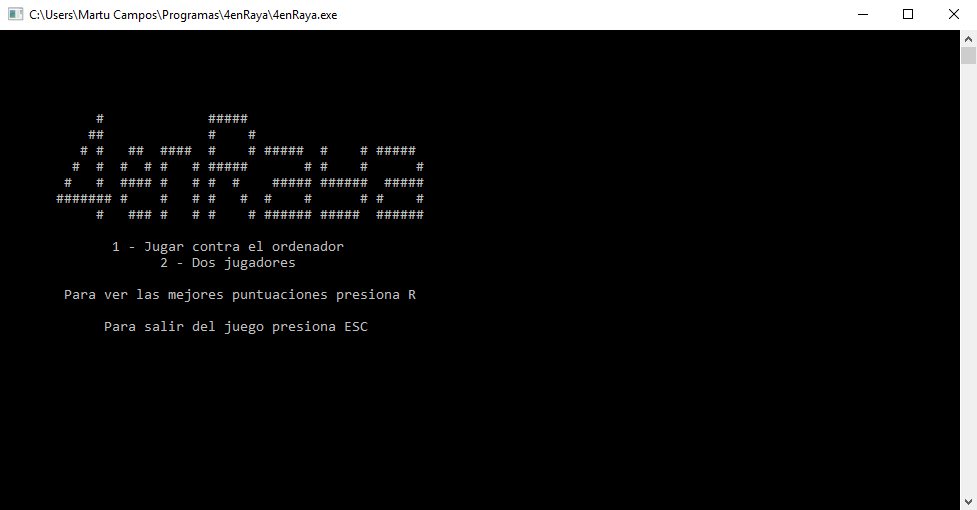
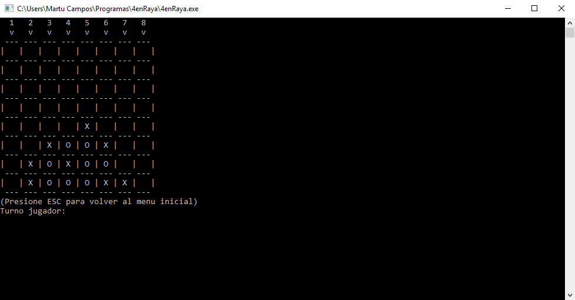
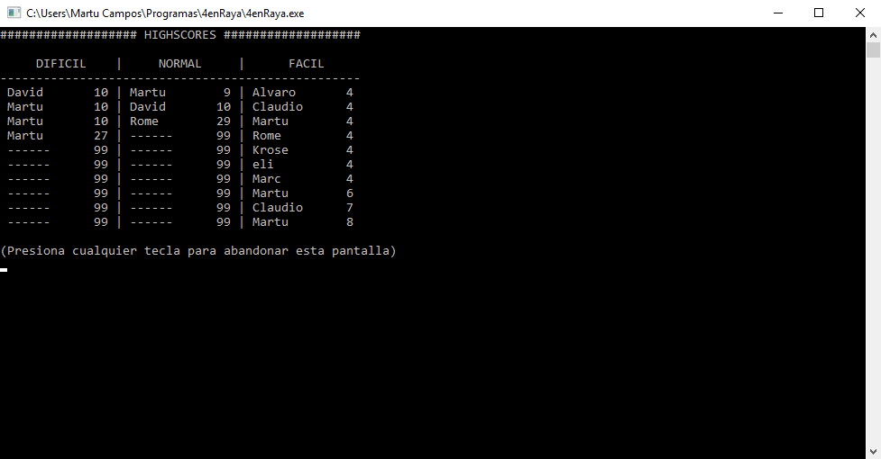

# 4enRaya
_Juego simple sobre consola del clásico 4 en raya para jugar contra el ordenador o 2 jugadores_

---------------

El algoritmo utilizado para el juego del ordenador está basado en el algoritmo del MiniMax con poda alfa beta. El programa está desarrollado íntegramente en C. Para compilarlo, basta con ejecutar en la carpeta del programa:

```
gcc -o 4enRaya.exe src/*.c
```

## Estructura del código

El código (todo él en la carpeta **src/**) se ha dividido en un **main.c** y tres librerías:
>  - **gamestuff.c**: contiene  funciones características del juego del 4 en raya en particular (como se decide una victoria, tamaño del tablero, como se aplica una tirada, función heurística, etc).
>  - **minimaxvar.c**: contiene todas las funciones del algoritmo MiniMax. El _var_ hace referencia a que de hecho es una ligera variante del MiniMax, dividiendo el valor heurístico de una partida mediante aumenta la profundidad del árbol de decisión (esto hace que el ordenador opte antes por jugadas que le sean favorables lo antes posible).
>  - **highscores.c**: contiene funciones para el registro de récords.

## Advertencia

> **_El juego ha sido desarrollado en Windows y para Windows!!_** \
> _Si se desea implementar en Linux, antes se deben cambiar tres cosas en el código:_
> - Cambiar los "system("cls")" por "system("clear")".
> - Cambiar las funciones de la librería "conio.h" -getch(),gectche()- que no se tienen de forma predeterminada a Linux.
> - Cambiar las funciones Beep() -que hacen un ruidito cuando se presiona una tecla incorrecta- de la librería "Windows.h".

>_El juego no ha sido testeado en Mac OSX._

## Preview





_Desarrollado por Martín Campos para la asignatura de 'Programació Avançada' del grado de Matemáticas de la Universitat Autònoma de Barcelona_
